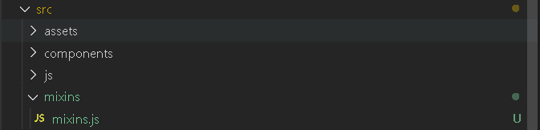

### 简介

`mixins` 选项接收一个混入对象的数组。这些混入对象可以像正常的实例对象一样包含实例选项，这些选项将会被合并到最终的选项中，使用的是和 `Vue.extend()` 一样的选项合并逻辑。也就是说，如果你的混入包含一个 created 钩子，而创建组件本身也有一个，那么两个函数都会被调用。

Mixin 钩子按照传入顺序依次调用，并在调用组件自身的钩子之前被调用。

#### 钩子函数的合并

  同名钩子函数将混合为一个[数组](https://so.csdn.net/so/search?q=数组&spm=1001.2101.3001.7020)，因此都将被调用。另外，混入对象的钩子函数将在组件自身钩子函数之前调用;

#### 数据对象合并

 数据对象在内部会进行浅合并 (一层属性深度)，在和组件的数据发生冲突时以组件数据优先（组件的data中变量会覆盖混入对象的data中变量）

#### 普通方法合并

 当混合值为对象的选项时，例如 methods、components、directive，将被混合为同一个对象，两个对象键名冲突时，取组件对象的键值对

<body>

    <div id="app"></div>
</body>

<script src="./vue.js"></script>
<script>
    var Mixins = {
        methods: {
            mixin: function() {
                console.log('Mixin')
            },
            mixinTwo: function () {
                console.log('MixinTwo')
            }
        }
    }
    new Vue({
        el: '#app',
        mixins: [Mixins],
        methods: {
            mixin: function () {
                console.log('#app')
            }
        },
        mounted() {
            this.mixin()
            this.mixinTwo()
        }
    })
</script>

	// #app
	// MixinTwo

#### 局部混入

 在 components 目录下创建一个mixins文件夹，并在 mixins 目录下创建一个 mixin.js 文件



在 mixin.js 文件里写入如下代码：

```javascript
export default {
    data () {
      return {
      }
    },
    created () {
      //钩子函数
    },
    methods: {
     //弹窗提示
      warningForpProvince () {
        this.$notify({
            title: '警告',
            message: '暂不支持省份选择，请选择城市',
            type: 'warning',
            position: 'top-left',
            duration:2000
          });
      }
    }
  }
```

    在需要的页面引入并使用

```javascript
import mixin from '../mixins/mixin'
export default {
	mixins: [mixin],
    data() {
	    return {
	    }
    }
	mounted() {
		this.mixinMethod()
	}
}

```

#### 全局混入

 在 main.js 中写入如下代码

```javascript
import Vue from 'vue'
import App from './App'
import router from './router'

Vue.config.productionTip = false

Vue.mixin({
  data() {
    return {
      msg: '哈哈'
    }
  },
  methods: {
    mixinMethod() {
      console.log(this.msg+'，这是mixin混入的方法')
    }
  }
})

/* eslint-disable no-new */
new Vue({
    el: '#app',
    router,
    components: { App },
    template: '<App/>'
})
```

在组件中直接使用

```javascript
<template>
	<div>{{msg}}</div>
</template>
<script>
export default {
    data() {
	    return {
	    }
    }
	mounted() {
		this.mixinMethod()
	}
}

// 哈哈，这是mixin混入的方法
</script>
```


